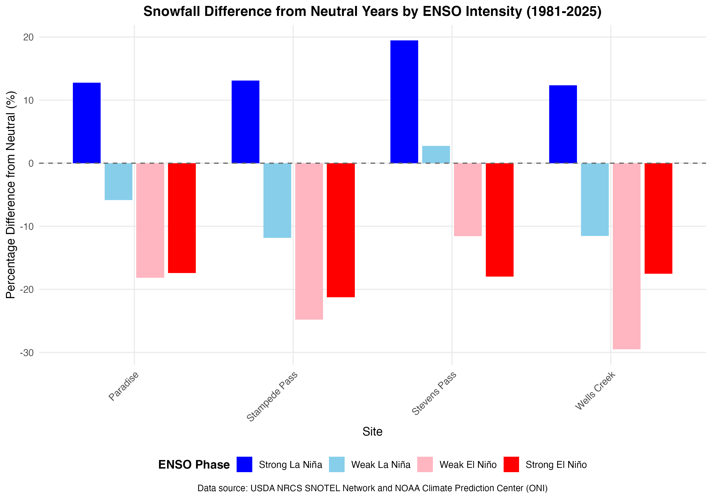
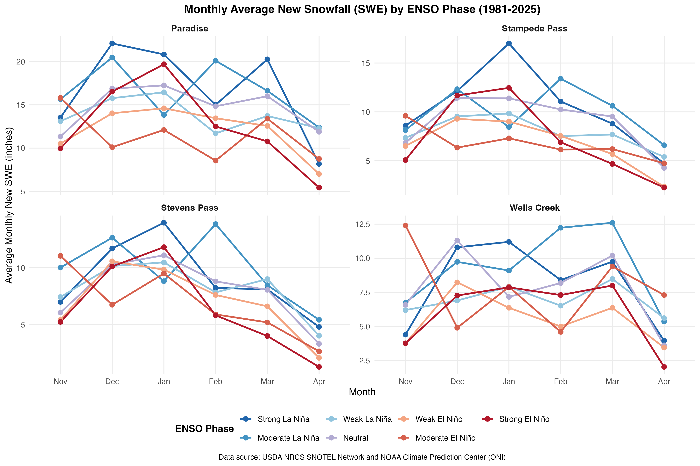

# WA Cascades Snowfall and ENSO Analysis - Summary of Results

## Analysis Overview

This analysis examined the relationship between ENSO (El Niño-Southern Oscillation) climate patterns and snowfall in the Washington Cascades from 1981-2025. Data from four SNOTEL sites were analyzed across seven ENSO phases, including Moderate intensity levels for both El Niño and La Niña events.

## Key Findings

### Percentage Difference from Neutral Years



The analysis reveals distinct patterns in how different ENSO phases affect snowfall across the four sites:

#### Paradise (Mount Rainier Region)
- **Strong La Niña**: +13.3% more snowfall than neutral years
- **Moderate La Niña**: +12.3% more snowfall than neutral years
- **Weak La Niña**: -5.8% less snowfall than neutral years
- **Weak El Niño**: -18.2% less snowfall than neutral years
- **Moderate El Niño**: -22.1% less snowfall than neutral years
- **Strong El Niño**: -15.1% less snowfall than neutral years

#### Stampede Pass (Snoqualmie Pass Region)
- **Strong La Niña**: +16.1% more snowfall than neutral years
- **Moderate La Niña**: +10.9% more snowfall than neutral years
- **Weak La Niña**: -11.8% less snowfall than neutral years
- **Weak El Niño**: -24.8% less snowfall than neutral years
- **Moderate El Niño**: -24.9% less snowfall than neutral years
- **Strong El Niño**: -19.8% less snowfall than neutral years

#### Stevens Pass
- **Strong La Niña**: +12.9% more snowfall than neutral years
- **Moderate La Niña**: +24.4% more snowfall than neutral years
- **Weak La Niña**: +2.7% more snowfall than neutral years
- **Weak El Niño**: -11.6% less snowfall than neutral years
- **Moderate El Niño**: -13.8% less snowfall than neutral years
- **Strong El Niño**: -19.6% less snowfall than neutral years

#### Wells Creek (Mount Baker Region)
- **Strong La Niña**: +3.1% more snowfall than neutral years
- **Moderate La Niña**: +18.5% more snowfall than neutral years
- **Weak La Niña**: -11.5% less snowfall than neutral years
- **Weak El Niño**: -29.5% less snowfall than neutral years
- **Moderate El Niño**: -1.2% less snowfall than neutral years
- **Strong El Niño**: -23.0% less snowfall than neutral years

## Major Insights

1. **Strong and Moderate La Niña generally bring more snow**: Most sites show increased snowfall during Strong and Moderate La Niña years, with Stevens Pass showing the largest increase during Moderate La Niña (+24.4%).

2. **El Niño years consistently bring less snow**: All El Niño intensity levels (Weak, Moderate, Strong) result in below-normal snowfall across all sites, with reductions ranging from 11% to 30%.

3. **Moderate intensity reveals important patterns**: The new Moderate categories show that:
   - Moderate La Niña can be more beneficial than Strong La Niña at some sites (e.g., Stevens Pass and Wells Creek)
   - Moderate El Niño impacts vary by site, from minimal effect at Wells Creek (-1.2%) to severe at Stampede Pass (-24.9%)

4. **Weak La Niña shows mixed results**: Only Stevens Pass sees increased snowfall during Weak La Niña (+2.7%), while Paradise, Stampede Pass, and Wells Creek all see decreased snowfall compared to neutral years.

5. **Wells Creek most affected by Weak El Niño**: The Mount Baker region shows the largest snowfall deficit during Weak El Niño years (-29.5%), but surprisingly shows minimal impact during Moderate El Niño (-1.2%).

6. **Regional variation is significant**: Different sites respond differently to the same ENSO phase, highlighting the importance of local topography and weather patterns in modulating ENSO effects.

## Monthly Patterns



The monthly analysis shows:
- Peak snowfall typically occurs in December-January across all ENSO phases
- Strong and Moderate La Niña years show consistently higher monthly snowfall throughout the season
- El Niño years show reduced snowfall in all months, particularly mid-winter

## Data Quality

- **Time Period**: 1981-2025 (44 complete snow seasons)
- **Sites**: 4 SNOTEL stations across WA Cascades
- **Data Source**: USDA NRCS SNOTEL Network and NOAA Climate Prediction Center
- **Metric**: Snow Water Equivalent (SWE) in inches

## Implications

These findings have important implications for:
- **Water resource management**: La Niña years may provide more snowpack for summer water supply
- **Winter recreation**: El Niño years may present challenges for ski areas
- **Climate adaptation**: Understanding ENSO patterns can help predict seasonal snowfall
- **Regional planning**: Different regions of the Cascades respond differently to ENSO

## Files Generated

### Data Files (in [data/](data/) folder)
- [oni_data.csv](data/oni_data.csv): Raw ONI data from NOAA
- `snotel_raw_*.csv`: Raw SNOTEL data for each site
- [snotel_processed.csv](data/snotel_processed.csv): Processed snowfall data with ENSO classifications
- [monthly_summary.csv](data/monthly_summary.csv): Monthly average new SWE by ENSO phase and site
- [percentage_difference.csv](data/percentage_difference.csv): Percentage difference from neutral years

### Plot Files (in [plots/](plots/) folder)
- [monthly_swe_by_enso_phase.png](plots/monthly_swe_by_enso_phase.png): Line plot of monthly patterns
- [percentage_difference_from_neutral.png](plots/percentage_difference_from_neutral.png): Bar plot of differences

## Running the Analysis

To reproduce this analysis:

```bash
/path/to/Rscript analysis.R
```

The script will:
1. Download current ONI data from NOAA
2. Download SNOTEL data for all four sites
3. Process and merge the datasets
4. Generate summary statistics
5. Create visualizations
6. Save all outputs to [data/](data/) and [plots/](plots/) folders

## References

- NOAA Climate Prediction Center: https://www.cpc.ncep.noaa.gov/
- USDA NRCS SNOTEL Network: https://www.nrcs.usda.gov/wps/portal/wcc/home/
- Oceanic Niño Index (ONI): Standard metric for identifying El Niño and La Niña events
